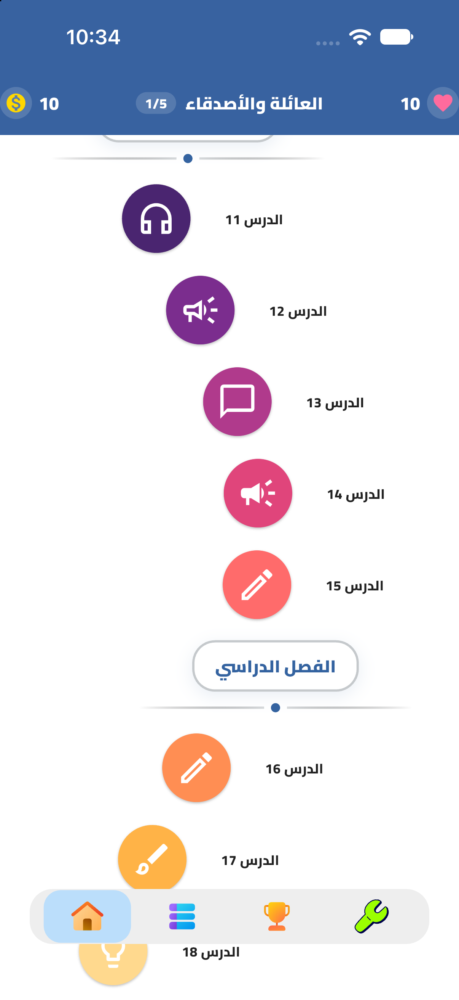
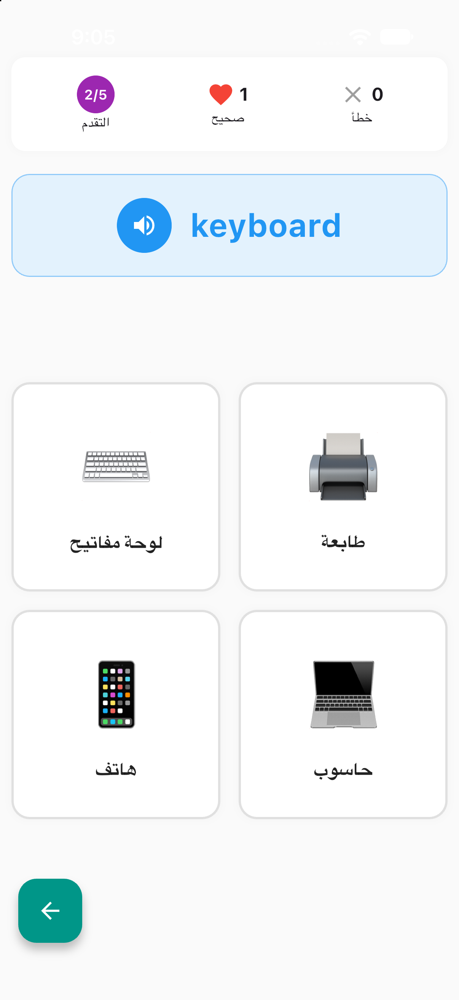
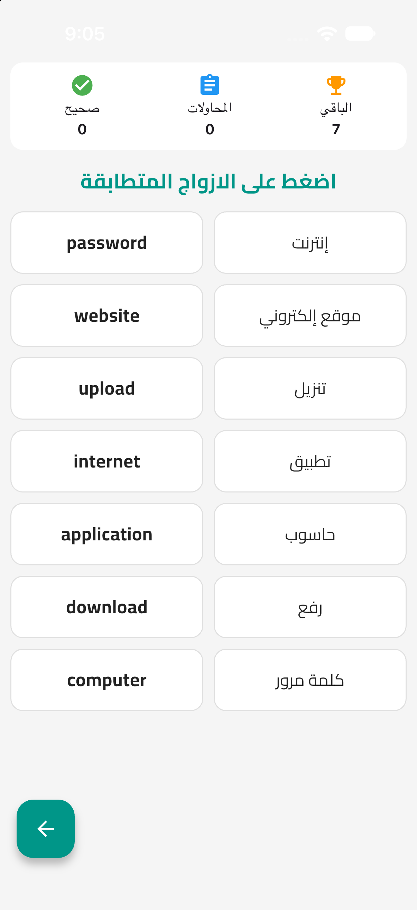
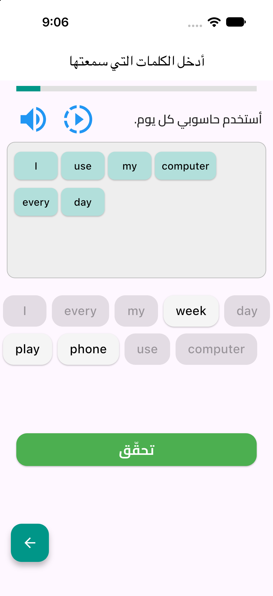

# 🎓 Engo - English Learning App

<div align="center">
  
  
  [](https://flutter.dev)
  [](https://dart.dev)
  [](https://pub.dev/packages/get)
</div>

## 📱 Description

Engo is an interactive English learning application built with Flutter. It provides a comprehensive learning experience through multiple levels of lessons, interactive quizzes, and listening exercises designed to help Arabic speakers master the English language.

## ✨ Features

### 🎯 Core Features
- **6 Learning Levels** (A1-A6) with progressive difficulty
- **Interactive Quiz System** with word selection and sentence reconstruction
- **Listening Exercises** with text-to-speech functionality
- **Progress Tracking** with visual indicators
- **Beautiful UI/UX** with modern design principles

### 🛠️ Technical Features
- **GetX State Management** for reactive programming
- **Convex Bottom Navigation** for intuitive navigation
- **Arabic-English Support** with proper RTL text direction
- **Audio Integration** with speed control for pronunciation
- **Responsive Design** adaptable to different screen sizes

## 📱 Screenshots

| RoadMap Screen | Lesson One Levels | Lesson Tow |
|:-------------:|:---------------:|:--------------:|
|  |  |  | 

## 🚀 Getting Started

### Prerequisites
- Flutter SDK (>=3.0.0)
- Dart SDK (>=3.0.0)
- Android Studio / VS Code
- Android device or emulator

### Installation

1. **Clone the repository**
   ```bash
   git clone https://github.com/YOUR_USERNAME/engo-english-learning-app.git
   cd engo-english-learning-app
